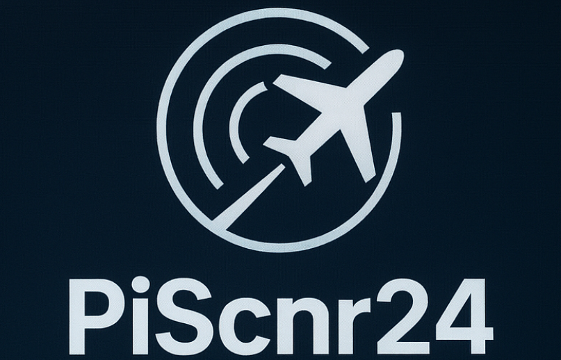
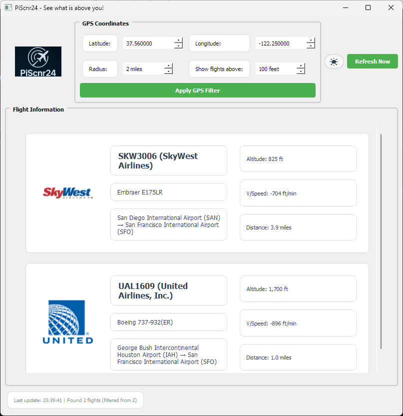

# PiScnr24 - Flight Tracker



A real-time flight tracking application that shows aircraft flying over your location using FlightRadar24 data. Built with Python and PyQt5, PiScnr24 provides an intuitive interface to monitor flights in your area with detailed information including aircraft types, routes, altitudes, and distances.

## ✈️ Features

- **Real-time Flight Tracking**: Live updates every 5 seconds
- **GPS-based Filtering**: Set your location and radius to see flights in your area
- **Interactive Flight Cards**: Click on any flight for detailed information
- **Airline Logos**: Visual airline identification with logos
- **Full Airport/Airline Names**: Human-readable names instead of codes
- **Altitude Filtering**: Show only flights above a specified altitude
- **Dark/Light Themes**: Toggle between themes for better viewing
- **Distance Calculation**: See how far each flight is from your location
- **Raw Data Access**: View complete flight data in popup windows

## Screenshots



## Quick Start

### Prerequisites

- Python 3.7 or higher
- Internet connection for flight data

### Installation

1. **Clone the repository**
   ```bash
   git clone https://github.com/yashmulgaonkar/PiScnr24.git
   cd PiScnr24
   ```

2. **Install dependencies**
   ```bash
   pip install -r requirements.txt
   ```

3. **Run the application**
   ```bash
   python piscnr24.py
   ```

### Auto-Start on Raspberry Pi Boot

To automatically start PiScnr24 when your Raspberry Pi boots up:

1. **Create a systemd service file**
   ```bash
   sudo nano /etc/systemd/system/piscnr24.service
   ```

2. **Add the following service configuration**
   ```ini
   [Unit]
   Description=PiScnr24 Flight Tracker
   After=network.target
   Wants=network.target

   [Service]
   Type=simple
   User=pi
   WorkingDirectory=/home/pi/PiScnr24
   ExecStart=/usr/bin/python3 /home/pi/PiScnr24/piscnr24.py
   Restart=always
   RestartSec=10
   Environment=DISPLAY=:0

   [Install]
   WantedBy=multi-user.target
   ```

3. **Enable and start the service**
   ```bash
   sudo systemctl daemon-reload
   sudo systemctl enable piscnr24.service
   sudo systemctl start piscnr24.service
   ```

4. **Check service status**
   ```bash
   sudo systemctl status piscnr24.service
   ```

5. **View logs if needed**
   ```bash
   sudo journalctl -u piscnr24.service -f
   ```

**Notes:**
- Replace `/home/pi/PiScnr24` with your actual project path
- Replace `pi` with your actual username
- The service will automatically restart if it crashes
- Make sure your Pi has a display connected for the GUI
- The service starts after network connectivity is established

### Touchscreen Setup (4inch HDMI Display-C)

For touchscreen functionality with the 4inch HDMI Display-C from LCDwiki:

1. **SSH into your Raspberry Pi**
   ```bash
   ssh pi@your-pi-ip-address
   ```

2. **Install touchscreen drivers**
   ```bash
   sudo rm -rf LCD-show
   git clone https://github.com/goodtft/LCD-show.git
   chmod -R 755 LCD-show
   cd LCD-show/
   sudo ./MPI4008-show
   ```

3. **Restart your Raspberry Pi**
   ```bash
   sudo reboot
   ```
   *Note: The Pi may restart automatically after driver installation*

**Touchscreen Information:**
- **Model**: 4inch HDMI Display-C
- **Source**: https://www.lcdwiki.com/4inch_HDMI_Display-C
- **Driver Repository**: https://github.com/goodtft/LCD-show.git
- **Driver Command**: `sudo ./MPI4008-show`

After installation, your touchscreen will be fully functional with PiScnr24!

## Requirements

- **FlightRadarAPI** (1.4.0) - Flight data source
- **PyQt5** (5.15.9) - GUI framework
- **requests** (2.32.4) - HTTP requests
- **urllib3** (2.5.0) - URL handling

## Usage

### Basic Operation

1. **Launch the application** - The GUI will start with default San Francisco coordinates
2. **Set your location** - Enter your latitude, longitude, and search radius
3. **Apply GPS filter** - Click "Apply GPS Filter" to update the search area
4. **Adjust altitude filter** - Set minimum altitude to filter out low-flying aircraft
5. **View flights** - Flight cards will appear showing aircraft in your area

### GPS Configuration

- **Latitude**: Your location's latitude (-90 to 90)
- **Longitude**: Your location's longitude (-180 to 180)
- **Radius**: Search radius in miles (1-1000)
- **Altitude Filter**: Minimum altitude in feet (0-50000)

### Flight Information

Each flight card displays:
- **Callsign**: Flight number with airline name
- **Aircraft Type**: Plane model and manufacturer
- **Route**: Origin → Destination with full airport names
- **Altitude**: Current altitude in feet
- **Vertical Speed**: Rate of climb/descent
- **Distance**: Miles from your location

## Configuration

### Default Settings

- **Refresh Interval**: 5 seconds
- **Window Size**: 1200x800 pixels
- **Default Location**: San Francisco, CA
- **Default Radius**: 2 miles
- **Max Flights**: 10 flights displayed

### Customization

Edit `config.py` to modify:
- GUI refresh intervals
- Window dimensions
- Default GPS coordinates
- Theme colors
- API settings

## Data Sources

- **FlightRadar24**: Real-time flight tracking data
- **IATA Airport Codes**: International airport database
- **ICAO Airline Codes**: International airline database
- **Airline Logos**: Comprehensive logo collection

## Troubleshooting

### Common Issues

1. **No flights showing**
   - Check your internet connection
   - Verify GPS coordinates are correct
   - Try increasing the search radius
   - Lower the altitude filter

2. **Application won't start**
   - Ensure all dependencies are installed: `pip install -r requirements.txt`
   - Check Python version (3.7+ required)

3. **Slow performance**
   - Reduce refresh interval in config
   - Lower maximum flight count
   - Check internet connection speed

### Debug Mode

The application includes built-in error handling and will continue running even if some data is unavailable.

## License


This project is licensed under the **Creative Commons Attribution-NonCommercial-ShareAlike 4.0 International License (CC BY-NC-SA 4.0)** - see the [LICENSE](LICENSE) file for details.

### Key License Terms:
- ✅ **Free for personal and educational use**
- ✅ **Open source - all derivatives must remain open source (ShareAlike)**
- ✅ **Attribution required - credit to original author**
- ❌ **Commercial use strictly prohibited (NonCommercial)**
- ❌ **No monetization or business use allowed**

**Important**: This software is provided for non-commercial use only. Any commercial use, including but not limited to selling, renting, or incorporating into commercial products, is strictly prohibited. All derivative works must be distributed under the same license terms.

For full license details, visit: https://creativecommons.org/licenses/by-nc-sa/4.0/

## Contributing

Contributions are welcome! Please feel free to submit a Pull Request. For major changes, please open an issue first to discuss what you would like to change.

### Development Setup

1. Fork the repository
2. Create a feature branch
3. Make your changes
4. Test thoroughly
5. Submit a pull request

## Support

If you encounter any issues or have questions:

1. Check the [Issues](https://github.com/ymulgaonkar/PiScnr24/issues) page
2. Create a new issue with detailed information
3. Include your system information and error messages


---

<div align="center"><strong>**PiScnr24** - See what's above you! ✈️</strong></div>
<br>
<div align="center"><strong>*Made with ❤️ for aviation enthusiasts*</strong></div>

<p align="center">
  <a href="https://buymeacoffee.com/yashmulgaonkar" target="_blank">
    
  </a>
</p>

---